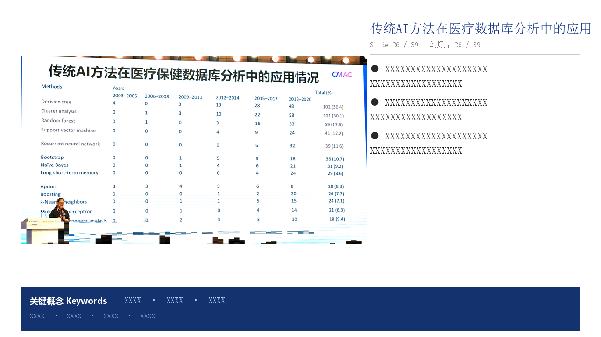

# ConferenceBuddy · Conference Slide Auto-Summary · 会议幻灯片自动总结

> **In one line: turn a stack of messy, glare-covered phone photos of conference slides into a clean, uniformly-formatted summary deck — automatically.**
>
> **一句话：把一沓在台下随手拍的、带眩光色偏的会议幻灯片照片，自动变成一份排版统一、干净专业的总结 PPT。**

[](https://github.com/tianmoul/conference-buddy/releases/latest)
[](LICENSE)

> The badge above always shows the latest published release — it updates itself.
> 上面的徽章实时显示最新发布版本，会自动更新。

---

## ✨ The WOW Factor: from a messy photo to a finished slide · 从一张潦草的照片到一页成品幻灯片

A photo you snap from the audience is rough: spotlights along the top, blue decorative frames on the sides, a blue color cast on the screen, rows of heads at the bottom, and glare. ConferenceBuddy **finds the real slide area → crops away the frames / spotlights / heads → restores the screen photo into a clean white "scanned document" → reads the content and writes Chinese bullet points → lays it into one consistent template** — with no manual cropping or data entry.

你在台下用手机拍的照片是这样的：上面一排射灯、左右蓝色装饰边框、屏幕偏蓝、下面全是观众后脑勺、还带着反光。ConferenceBuddy 会**自动识别中间真正的幻灯片区域 → 裁掉边框/射灯/人头 → 把翻拍屏幕还原成干净的白底"扫描件" → 读懂内容并写成中文要点 → 排进统一模板**，全程不需要手动抠图或录入。


The five steps above: ① raw phone photo → ② auto-detected slide region (green box) → ③ crop → ④ scan to a clean document → ⑤ the finished output slide (processed slide on the left, auto-written summary on the right, a fixed keyword bar at the bottom).

上图五步：① 原始手机照片 → ② 自动识别 PPT 区域（绿框）→ ③ 裁切 → ④ 扫描成白底文档 → ⑤ 最终成品幻灯片（左边处理后的幻灯片图，右边自动写出的摘要，底部固定位置的关键概念栏）。

A closer look at the finished slide · 成品幻灯片放大：



> 🔒 **Privacy note · 隐私说明** — In these example images every face and the audience area are heavily pixelated, and the right-column summary, keywords, and footer are replaced with `XXXX`; the example uses a methodology table with no personal names or place names.
> 示例图中所有人脸和观众区域均已重度马赛克，右侧摘要、关键词与页脚均用 `XXXX` 占位；示例选用不含人名、地名的方法学表格页。

---

## 🧠 What it does · 它做了什么

You point it at a folder of conference slide photos, and it will:

你把一个装满会议幻灯片照片的文件夹交给它，它会：

| # | English | 中文 |
|---|---------|------|
| 1 | **Scan** the folder, auto-detecting a `Focus/` + `Other/` layout, or treating everything as Focus | **扫描文件夹**，自动识别 `Focus/`（主讲）+ `Other/`（其他讲者）结构，或把所有照片当作主讲 |
| 2 | **Auto-crop** each photo to the real slide region — frames, spotlights, audience removed | **自动裁切**：识别真正的 PPT 区域，去掉左右边框、上方射灯、下方观众 |
| 3 | **Scan** away the color cast / glare to a clean white "document" look (dark-themed slides skipped automatically) | **扫描还原**：去掉屏幕色偏/眩光，还原成干净白底"扫描件"（深色主题幻灯片自动跳过） |
| 4 | **Read** each slide with Claude vision — title, keywords, bullet points (in Chinese) | **视觉读图**：用 Claude 视觉读懂每张幻灯片，提取标题、关键词、要点（中文） |
| 5 | **Generate** a PPTX with a layout that never drifts page to page | **制式生成**：排进一个版式永远一致的 PPT |

---

## 🚀 Installation & Deployment · 安装与部署

ConferenceBuddy is a "Skill" — just a folder you drop into your AI coding assistant's skills directory. Three environments are covered below. **Users in mainland China should use Tencent CodeBuddy (Option B)**, since Claude Code is not directly available there.

ConferenceBuddy 是一个"技能（Skill）"——本质就是一个文件夹，放进 AI 编程助手的技能目录即可。下面给出三种环境。**中国大陆用户建议用腾讯 CodeBuddy（方案 B）**，因为 Claude Code 在国内无法直接使用。

### Prerequisites · 前置依赖

```bash
pip install python-pptx Pillow opencv-python numpy
```

You also need the **SimSun (宋体)** and **Times New Roman** fonts (bundled with Windows) for Chinese rendering.

还需要系统里有**宋体**和 **Times New Roman**（Windows 自带），用于中文渲染。

---

### Option A · Claude Code (international) · 方案 A · Claude Code（国际用户）

1) Install Claude Code (docs: https://claude.com/claude-code). 2) Clone this repo and copy the whole `conference-buddy` folder into your skills directory.

1) 安装 Claude Code（官方文档同上）。2) 克隆本仓库，把整个 `conference-buddy` 文件夹复制到技能目录。

```bash
git clone https://github.com/tianmoul/conference-buddy.git
# Windows
xcopy /E /I conference-buddy "%USERPROFILE%\.claude\skills\conference-buddy"
# macOS / Linux
cp -r conference-buddy ~/.claude/skills/
```

3) In Claude Code, just say "会议总结" / "conference summary" with the photo folder path.

3) 在 Claude Code 里直接说「会议总结 + 照片文件夹路径」即可触发。

---

### Option B · Tencent CodeBuddy (recommended in China) · 方案 B · 腾讯 CodeBuddy（国内推荐）

CodeBuddy is Tencent Cloud's AI coding assistant; its CLI, **CodeBuddy Code**, works much like Claude Code and **supports Skills**. This is the go-to for users in China.

CodeBuddy 是腾讯云的 AI 代码助手，其命令行版 **CodeBuddy Code** 用法与 Claude Code 基本一致，并且**支持 Skill**。这是国内用户的首选。

**Step 1: Install the CLI · 第 1 步：安装 CLI** — requires Node.js 18.20+ · 需要 Node.js 18.20 以上

```bash
npm install -g @tencent-ai/codebuddy-code
```

Or the Node-free native installer · 或免 Node 的原生安装包：

```powershell
# Windows (PowerShell)
irm https://www.codebuddy.cn/cli/install.ps1 | iex
```
```bash
# macOS / Linux
curl -fsSL https://www.codebuddy.cn/cli/install.sh | bash
```

Verify · 验证安装：`codebuddy --version`

**Step 2: Drop the skill into the skills directory · 第 2 步：放入技能目录**

CodeBuddy's skills directory is `~/.codebuddy/skills/` (`%USERPROFILE%\.codebuddy\skills\` on Windows).

CodeBuddy 的技能目录是 `~/.codebuddy/skills/`（Windows 为 `%USERPROFILE%\.codebuddy\skills\`）。

```bash
git clone https://github.com/tianmoul/conference-buddy.git
# Windows
xcopy /E /I conference-buddy "%USERPROFILE%\.codebuddy\skills\conference-buddy"
# macOS / Linux
cp -r conference-buddy ~/.codebuddy/skills/
```

**Step 3: Use it · 第 3 步：使用** — start `codebuddy` and say "会议总结 D:\photos\my-conf".

启动 `codebuddy`，说「会议总结 D:\照片\某会议」即可。

> Docs · 官方文档: https://www.codebuddy.ai/docs/zh/cli/installation

---

### Option C · WorkBuddy (Tencent's office-agent app) · 方案 C · WorkBuddy（腾讯职场智能体 App）

**WorkBuddy** is Tencent's "office AI agent" desktop/mobile workspace for non-coders: describe a task in one sentence and it plans and executes like a colleague. Android users can search "**WorkBuddy**" in Huawei AppGallery, Xiaomi GetApps, or Tencent MyApp.

**WorkBuddy** 是腾讯推出的"职场 AI 智能体"桌面/手机工作台，面向不写代码的普通办公用户：用一句话描述需求，它像同事一样自主规划并执行。安卓用户可在华为应用市场、小米应用商店、应用宝搜索「**WorkBuddy**」下载。

⚠️ WorkBuddy is the end-user product; installing and running Skills today is done through **CodeBuddy Code (Option B)**. If you just want the finished deck without a terminal, ask a colleague who uses CodeBuddy to run Option B once for you.

⚠️ WorkBuddy 偏向"终端用户"产品，技能的安装与运行目前以 **CodeBuddy Code（方案 B）** 为准。如果你只想要成品 PPT 而不想碰命令行，可以请会用 CodeBuddy 的同事按方案 B 跑一次。

> Site · 官网: https://www.codebuddy.cn/work/

---

## 📂 Photo library layout · 照片库结构

```
Library/
└── 2026_06_25_MyConf/
    ├── Focus/          ← main speaker, one slide per photo · 主讲，每张照片一页
    │   └── ...
    └── Other/          ← other speakers, 3 photos each · 其他讲者，每位 3 张
        └── ...
```

No subfolders is fine — every photo in the root is treated as a Focus slide.

没有子文件夹也行——根目录里的所有照片都会被当作主讲幻灯片。

---

## ⚙️ Configuration · 配置项

Every setting lives at the top of the generated script — change one line, never touch the rendering code below.

所有参数都在生成脚本顶部，改一行即可，下面的渲染代码不用动。

```python
# Fonts (Chinese / Latin set separately) · 字体（中文/英文分别设置）
FONT_ZH      = '宋体'                 # Chinese typeface · 中文字体
FONT_EN      = 'Times New Roman'      # Latin typeface · 英文字体

# Summary font size — the key knob! · 摘要字号——关键可调项！
SUMMARY_SIZE = 14   # Bigger (14/16) = easier to read; smaller (11/12) = fits more text.
                    # 调大(14/16)看得清楚；想塞更多文字就调小(11/12)。子点自动 = -2。
OTHER_SIZE   = 13   # Other-speaker bullet size · 其他讲者要点字号

# Document-scan · 扫描效果
SCAN_MODE    = 'auto'   # 'auto' (scan light, skip dark) | 'on' | 'off' · 自动/全扫/关闭
FORCE_NOSCAN = set()    # nums to always keep as a plain crop · 强制不扫描的照片编号

# Layout · 版式
LAYOUT = '16:9'         # '16:9' widescreen (default) or 'A4' landscape · 宽屏(默认) 或 A4 横向
```

**About sizes**: 14 pt reads comfortably, but if you want long text summaries it may be too big — just lower `SUMMARY_SIZE` to 11 or 12.

**关于字号**：14 号看着清楚，但如果想写很多文字摘要，14 号可能太大放不下——把 `SUMMARY_SIZE` 调到 11 或 12 即可。

---

## 🗣️ How to trigger · 触发方式

### 💡 Easiest of all — let the assistant install it for you · 最省事：让助手自己装

Don't want to touch a terminal? Just talk to **WorkBuddy** or **Claude Code** in plain language:

懒得碰命令行？直接用大白话对 **WorkBuddy** 或 **Claude Code** 说：

```
帮我安装这个仓库的 skill：https://github.com/tianmoul/conference-buddy
Install the skill from https://github.com/tianmoul/conference-buddy
```

The assistant clones the repo into the skills directory for you. Then start a new chat and invoke it with the slash command:

助手会自动把仓库克隆到技能目录。装好后新开一段对话，用斜杠命令调用：

```
/conference-buddy
```

…and tell it where your photos are. · ……然后告诉它照片在哪个文件夹即可。

---

### Or trigger by phrase · 或用关键词触发

Say any of these in Claude Code / CodeBuddy · 在 Claude Code / CodeBuddy 里说出任意一句：

```
会议总结 D:\Library\2026_06_25_MyConf
conference summary from this folder
generate conference PPTX from Library/2026_06_25_MyConf
```

It asks for the conference name, date, and venue, analyzes each photo (~5–10 s each), then produces the PPTX and reports the file path and page count.

它会先问你会议名称、日期、地点，逐张分析照片（每张约 5–10 秒），最后生成 PPT 并告诉你文件路径和页数。

---

## 🛠️ How it works under the hood · 技术原理

The crop and scan logic lives in `slide_crop.py` and relies on **color-agnostic** cues, so it transfers to other venues (e.g. red frames, or no spotlight bar):

裁切和扫描的核心都在 `slide_crop.py`，用的是**与颜色无关**的通用信号，所以换成别的会场（比如红色边框、没有射灯）也能用：

- **Top/bottom**: the slide is bright; spotlights/ceiling/audience are dark → take the longest run of bright rows. · **上下边界**：幻灯片亮、射灯/天花板/观众暗 → 取最长亮行区间。
- **Left/right**: the decorative frame is far more saturated than the content → cut to the inner edge of the saturated band. · **左右边界**：装饰边框饱和度远高于内容 → 切到高饱和边带内沿。
- **Scan**: a tinted screen turns white into light blue; a white-patch white balance restores neutral white, then lighting is flattened and text sharpened. · **扫描去色偏**：翻拍屏幕让白底变浅蓝，用"白点白平衡"还原中性白，再拉平光照、锐化文字。

Validated against 51 hand-made crops at 1.3% mean edge error. · 在 51 张人工标注裁切上验证，平均边界误差 1.3%。

---

## 📦 Changelog · 版本

- **2.1.1** — Configurable fonts (SimSun 宋体 / Times New Roman) and adjustable summary size; bilingual README with a 5-step pipeline showcase. · 字体可配置（中文宋体 / 英文 Times New Roman）、摘要字号可调；双语 README 加入 5 步流程展示图。
- **2.1.0** — Document-scan effect (clean white look, dark slides auto-skipped). · 扫描件效果（白底质感，暗片自动跳过）。
- **2.0.0** — Automatic content cropping (frames/spotlights/audience removed), color-agnostic. · 自动裁切（去边框/射灯/观众），颜色无关可泛化。
- **1.0.0** — Vision reading + consistent-layout PPTX generation. · 视觉读图 + 制式生成 PPT。

---

## 📄 License · 许可

MIT

---

*Built with Claude Code / Tencent CodeBuddy · 用 [Claude Code](https://claude.com/claude-code) / [腾讯 CodeBuddy](https://www.codebuddy.cn/) 构建*
